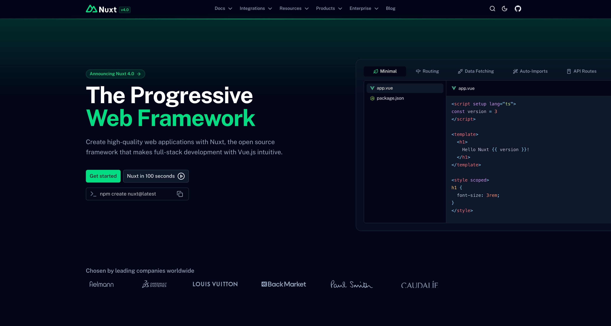

<a href="https://nuxt.com"></a>

[](https://nuxt.com/mcp/deeplink)
[](https://nuxt.com/mcp/deeplink?ide=vscode)

# nuxt-ru.vercel.app

Добро пожаловать на сайт-репозиторий Nuxt, доступный по адресу [https://nuxt-ru.vercel.app](https://nuxt-ru.vercel.app).

[](https://ui.nuxt.com)

## Настройка

Make sure to enable corepack and install the dependencies:

```bash
corepack enable
pnpm install
```

Скопируйте файл `.env.example` в файл `.env`:

```bash
cp .env.example .env
```

Clone/Fork [nuxt/nuxt](https://github.com/translation-gang/nuxt) repo where you want (but not in the Nuxt.com project) and inside the root of the repo, run:

```bash
pwd
```

Если вы работаете под Windows, вместо этого можно использовать следующую команду:

```bash
echo %cd%
```

Скопируйте вывод команды выше и вставьте его в переменные `NUXT_V3_PATH` и `NUXT_V4_PATH` в файле `.env`.

## Разработка

Запустите сервер разработки:

```bash
pnpm dev
```

Чтобы запустить сервер разработки с полной подгрузкой контента (модули, API и т.д.):

```bash
pnpm dev:full
```

### Добавление шаблона Nuxt

Чтобы добавить шаблон Nuxt в список, добавьте его в папку [./content/templates](./content/templates).

Обязательно запустите сервер разработки, чтобы сгенерировать скриншот для шаблона, и перейдите по адресу <http://localhost:3000/templates>, чтобы увидеть результат.

Если вы хотите обновить url, по которому мы делаем автоматический скриншот, используйте свойство `screenshotUrl`.

Чтобы сгенерировать изображение заново, удалите сгенерированное в папке `public/assets/templates`.

## Продакшен

Соберите production-приложение:

```bash
pnpm build
```

## Деплой на Vercel (фазы 1.5–1.6)

### Переменные окружения в Vercel

В настройках проекта Vercel → Settings → Environment Variables задайте:

**Обязательные для сборки и работы:**

| Переменная | Описание |
|------------|----------|
| `NUXT_SESSION_PASSWORD` | Пароль для шифрования сессий (nuxt-auth-utils). Сгенерировать: `openssl rand -base64 32` |
| `NUXT_PUBLIC_SITE_URL` | URL сайта, например `https://nuxt-ru.vercel.app` |

**Рекомендуемые (иначе часть страниц/API будет падать при пререндере или в рантайме):**

| Переменная | Описание |
|------------|----------|
| `NUXT_GITHUB_TOKEN` | GitHub Personal Access Token с доступом к репозиторию (для модулей, team, stats) |

**Опционально:** см. `.env.example` (Turnstile, Resend, Open Collective, OAuth для админки отзывов и т.д.).

### Сборка в Vercel

Используются настройки из `vercel.json`:

- **Build Command:** `NODE_OPTIONS='--max-old-space-size=8192' pnpm run build`
- **Install Command:** `corepack enable && corepack prepare pnpm@10.29.3 --activate && pnpm install`

При необходимости их можно переопределить в Vercel → Settings → General.

### NuxtHub (1.6)

- В проекте уже используется `@nuxthub/core` ^0.10.6, БД — sqlite (для продакшена на Vercel используется драйвер Vercel).
- Если меняете схему БД в `server/db/schema.ts`, локально выполните:
  ```bash
  pnpm db:generate
  pnpm db:migrate
  ```
- Привязка проекта к NuxtHub (если нужен дашборд/бэкап): `npx nuxthub@latest login` и `npx nuxthub@latest link`.

### Evals для MCP-сервера

Для запуска evals убедитесь, что dev-сервер запущен, создайте API-ключ на https://vercel.com/ai-gateway и добавьте `AI_GATEWAY_API_KEY` в `.env`. Затем: `pnpm eval` или `pnpm eval:ui`.

## Лицензия

[MIT License](./LICENSE)
